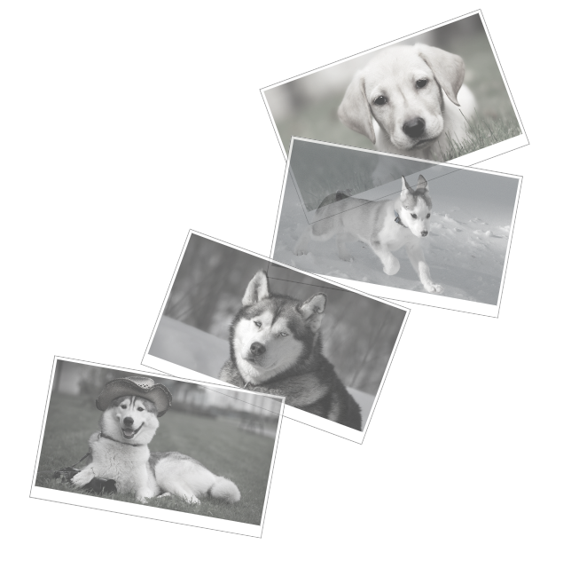
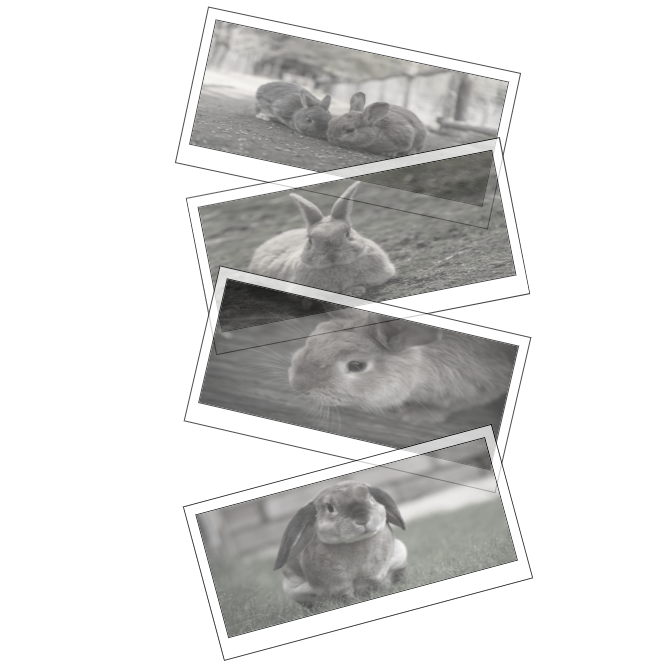

## Galerie 
**Aufgabe**: Nach dem Muster ähnliches Bild erstellen. 
Muster:

Mein Ergebnis:

**Beschreibung**: Nach dem Anklick tritt das Photo an und wird gefärbt.

**Lernen**: CSS - transform, opacity, z-index, filter

